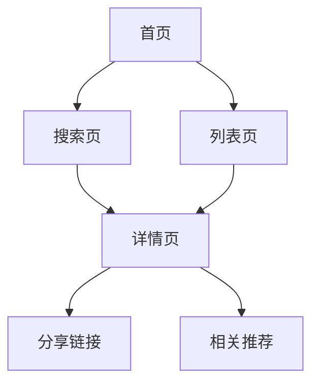

## 1. 产品概述
视频资源搜索网站，采用类似TMDB的视觉风格设计，为用户提供影视资源搜索和浏览服务。用户可以通过关键词搜索、分类筛选等方式快速找到所需的影视资源，并通过直链分享功能与朋友分享感兴趣的内容。

目标用户群体为影视爱好者和内容分享者，解决用户在海量影视资源中快速定位优质内容的需求，提供便捷的分享体验。

## 2. 核心功能

### 2.1 用户角色
| 角色 | 注册方式 | 核心权限 |
|------|----------|----------|
| 访客用户 | 无需注册 | 浏览、搜索、查看详情、分享链接 |
| 注册用户 | 邮箱注册 | 收藏、历史记录、个性化推荐 |

### 2.2 功能模块
网站包含以下核心页面：
1. **首页**：热门推荐、分类导航、搜索入口
2. **搜索页**：关键词搜索、筛选功能、搜索结果展示
3. **列表页**：资源列表、分类筛选、分页功能
4. **详情页**：资源详情、分享链接、相关推荐

### 2.3 页面详情
| 页面名称 | 模块名称 | 功能描述 |
|----------|----------|----------|
| 首页 | 热门推荐轮播 | 展示热门影视资源，支持自动轮播和手动切换 |
| 首页 | 分类导航 | 提供影视分类快速入口（电影、电视剧、综艺等） |
| 首页 | 搜索框 | 支持关键词输入，实时搜索建议 |
| 搜索页 | 搜索栏 | 关键词输入，支持拼音和模糊搜索 |
| 搜索页 | 筛选器 | 按类型、年份、地区、评分等条件筛选 |
| 搜索页 | 结果列表 | 展示搜索结果，支持排序和分页 |
| 列表页 | 资源卡片 | 展示影视海报、标题、评分、简介等基本信息 |
| 列表页 | 分页导航 | 支持页码跳转和每页数量设置 |
| 列表页 | 分类筛选 | 侧边栏筛选，支持多条件组合 |
| 详情页 | 资源信息 | 展示详细影视信息（海报、标题、简介、演员等） |
| 详情页 | 分享功能 | 生成直链分享链接，支持社交媒体分享 |
| 详情页 | 相关推荐 | 基于分类或标签推荐相似资源 |

## 3. 核心流程

### 用户浏览流程
用户访问首页 → 浏览热门推荐或使用搜索功能 → 查看搜索结果或分类列表 → 点击感兴趣的资源 → 查看详情页面 → 使用分享功能分享链接

### 用户搜索流程
用户在搜索框输入关键词 → 系统实时显示搜索建议 → 用户确认搜索 → 显示搜索结果列表 → 用户筛选和排序 → 选择具体资源查看详情

## 4. 用户界面设计

### 4.1 设计风格
- **主色调**：深蓝色（#032541）作为主色，搭配白色背景
- **辅助色**：浅蓝色（#01b4e4）用于强调和交互元素
- **按钮样式**：圆角矩形，悬停效果，3D阴影
- **字体**：系统默认字体，标题18-24px，正文14-16px
- **布局风格**：卡片式布局，网格系统，响应式设计
- **图标风格**：使用简洁的线性图标，支持深色模式

### 4.2 页面设计概述
| 页面名称 | 模块名称 | UI元素 |
|----------|----------|--------|
| 首页 | 热门推荐 | 全宽轮播图，自动切换，指示器，标题覆盖在图片上 |
| 首页 | 分类导航 | 网格布局，图标+文字，悬停放大效果 |
| 搜索页 | 搜索栏 | 圆角输入框，搜索图标，清除按钮，搜索建议下拉框 |
| 搜索页 | 结果列表 | 卡片网格布局，海报图片，评分徽章，标题和简介 |
| 列表页 | 资源卡片 | 固定宽高比，悬停显示详细信息，加载动画 |
| 详情页 | 资源信息 | 左侧海报，右侧详细信息，标签云，演员表横向滚动 |
| 详情页 | 分享功能 | 分享按钮组，链接复制，二维码生成 |

### 4.3 响应式设计
- **桌面优先**：默认设计为桌面端，然后适配移动端
- **断点设置**：768px（平板）、480px（手机）
- **移动端优化**：触摸手势支持，简化导航，卡片单列显示
- **性能优化**：图片懒加载，渐进式加载，骨架屏