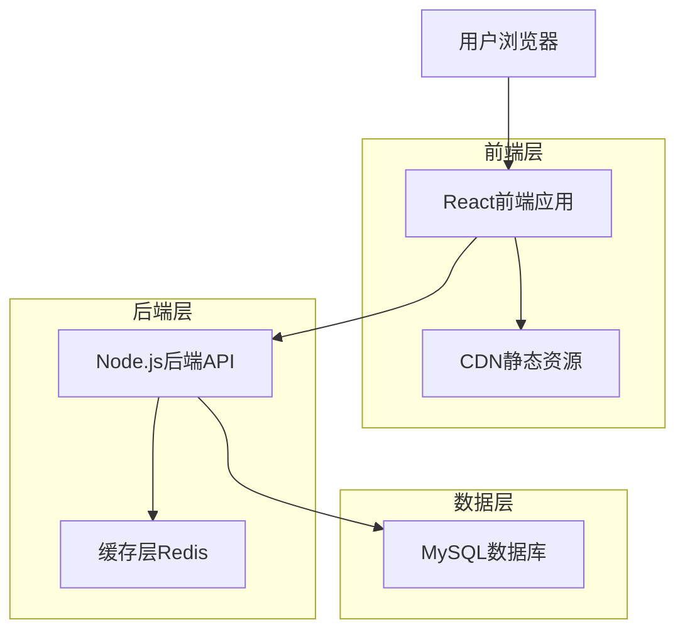
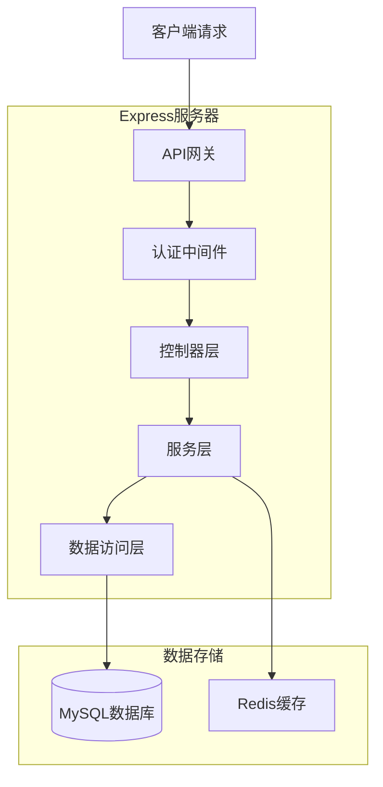
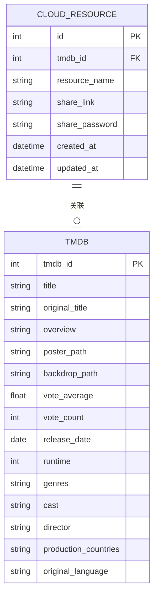

## 1. 架构设计



## 2. 技术栈描述

* **前端**: React\@18 + TypeScript\@5 + Vite\@4 + Tailwind CSS\@3

* **后端**: Node.js\@18 + Express\@4 + TypeScript\@5

* **数据库**: MySQL\@8.0

* **缓存**: Redis\@7.0

* **部署**: Docker + Nginx

## 3. 路由定义

| 路由                | 用途                |
| ----------------- | ----------------- |
| /                 | 首页，展示热门推荐和分类导航    |
| /search           | 搜索页，关键词搜索和筛选功能    |
| /category/:type   | 分类列表页，按类型展示资源     |
| /detail/:id       | 详情页，展示单个资源详细信息    |
| /share/:id        | 分享页，用于社交媒体分享的静态页面 |
| /api/search       | API搜索接口           |
| /api/resource/:id | API资源详情接口         |
| /api/related/:id  | API相关推荐接口         |

## 4. API定义

### 4.1 搜索API

```
GET /api/search
```

请求参数：

| 参数名     | 参数类型   | 是否必需  | 描述                           |
| ------- | ------ | ----- | ---------------------------- |
| keyword | string | false | 搜索关键词                        |
| type    | string | false | 资源类型（movie/tv/show）          |
| year    | number | false | 年份筛选                         |
| region  | string | false | 地区筛选                         |
| page    | number | false | 页码，默认1                       |
| limit   | number | false | 每页数量，默认20                    |
| sort    | string | false | 排序方式（rating/date/popularity） |

响应数据：

```json
{
  "code": 200,
  "message": "success",
  "data": {
    "items": [
      {
        "id": 1,
        "tmdb_id": 12345,
        "title": "资源标题",
        "poster": "https://image.tmdb.org/...",
        "rating": 8.5,
        "year": 2023,
        "type": "movie",
        "summary": "简介..."
      }
    ],
    "total": 100,
    "page": 1,
    "limit": 20
  }
}
```

### 4.2 资源详情API

```
GET /api/resource/:id
```

响应数据：

```json
{
  "code": 200,
  "message": "success",
  "data": {
    "id": 1,
    "tmdb_id": 12345,
    "title": "资源标题",
    "original_title": "Original Title",
    "poster": "https://image.tmdb.org/...",
    "backdrop": "https://image.tmdb.org/...",
    "rating": 8.5,
    "year": 2023,
    "runtime": 120,
    "genres": ["动作", "科幻"],
    "summary": "详细简介...",
    "cast": ["演员1", "演员2"],
    "director": "导演",
    "share_link": "https://site.com/share/1",
    "download_links": [
      {
        "name": "网盘1",
        "url": "https://pan.baidu.com/...",
        "password": "1234"
      }
    ]
  }
}
```

### 4.3 相关推荐API

```
GET /api/related/:id
```

响应数据：

```json
{
  "code": 200,
  "message": "success",
  "data": {
    "items": [
      {
        "id": 2,
        "title": "相关资源1",
        "poster": "https://image.tmdb.org/...",
        "rating": 8.0,
        "similarity": 0.85
      }
    ]
  }
}
```

## 5. 服务器架构图



## 6. 数据模型

### 6.1 数据模型定义



### 6.2 数据定义语言

**cloud\_resource表**

```sql
CREATE TABLE cloud_resource (
    id INT PRIMARY KEY AUTO_INCREMENT,
    tmdb_id INT NOT NULL,
    resource_name VARCHAR(255) NOT NULL,
    share_link VARCHAR(500) NOT NULL,
    share_password VARCHAR(50),
    created_at DATETIME DEFAULT CURRENT_TIMESTAMP,
    updated_at DATETIME DEFAULT CURRENT_TIMESTAMP ON UPDATE CURRENT_TIMESTAMP,
    INDEX idx_tmdb_id (tmdb_id),
    INDEX idx_created_at (created_at),
    FOREIGN KEY (tmdb_id) REFERENCES tmdb(tmdb_id)
);
```

**tmdb表**

```sql
CREATE TABLE tmdb (
    tmdb_id INT PRIMARY KEY,
    title VARCHAR(255) NOT NULL,
    original_title VARCHAR(255),
    overview TEXT,
    poster_path VARCHAR(255),
    backdrop_path VARCHAR(255),
    vote_average FLOAT DEFAULT 0,
    vote_count INT DEFAULT 0,
    release_date DATE,
    runtime INT,
    genres JSON,
    cast JSON,
    director VARCHAR(255),
    production_countries VARCHAR(255),
    original_language VARCHAR(10),
    created_at DATETIME DEFAULT CURRENT_TIMESTAMP,
    updated_at DATETIME DEFAULT CURRENT_TIMESTAMP ON UPDATE CURRENT_TIMESTAMP,
    INDEX idx_title (title),
    INDEX idx_release_date (release_date),
    INDEX idx_vote_average (vote_average),
    FULLTEXT idx_title_search (title, original_title)
);
```

## 7. 技术实现要点

### 7.1 SEO优化方案

* **服务端渲染(SSR)**: 使用Next.js或自建SSR服务

* **静态页面生成**: 为热门资源预生成静态页面

* **Meta标签优化**: 动态生成title、description、Open Graph标签

* **结构化数据**: 添加JSON-LD格式的影视数据

* **Sitemap**: 自动生成XML站点地图

### 7.2 性能优化策略

* **数据库优化**:

  * 添加复合索引优化搜索查询

  * 使用全文搜索功能

  * 实施查询结果缓存

* **前端优化**:

  * 图片懒加载和WebP格式

  * 代码分割和懒加载

  * CDN加速静态资源

* **缓存策略**:

  * Redis缓存热门搜索结果

  * 浏览器缓存策略

  * API响应缓存

### 7.3 响应式设计实现

* **移动优先**: 基础样式适配移动端

* **弹性布局**: 使用Flexbox和Grid布局

* **图片响应式**: 根据屏幕尺寸加载不同尺寸图片

* **触摸优化**: 支持滑动、捏合等手势操作

### 7.4 安全性考虑

* **SQL注入防护**: 使用参数化查询

* **XSS防护**: 输入验证和输出编码

* **API限流**: 实施请求频率限制

* **HTTPS**: 强制使用HTTPS协议

